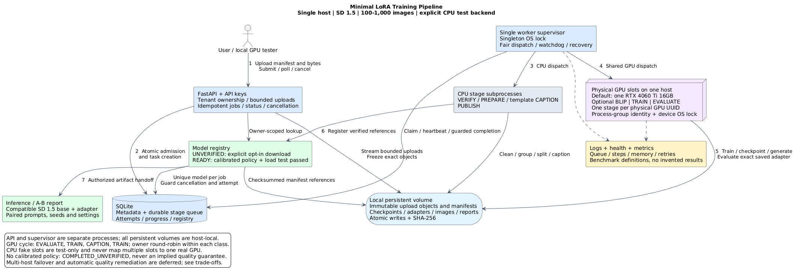

# Automatic LoRA Training Pipeline

单机 LoRA 训练流水线作业：FastAPI + SQLite + 本地制品存储 + 独立 worker。支持真实 SD 1.5 LoRA、离线 CPU 小模型测试、可选 BLIP caption、CLIP 诊断与配对 A/B 报告。

## 交付入口

| 内容 | 中文 | English |
|---|---|---|
| Part 1 架构与图 | [系统架构](docs/01-system-architecture.md) | [Architecture](docs_en/01-system-architecture.md) |
| 组件、状态与 API 契约 | [技术规格](docs/02-technical-specification.md) | [Specification](docs_en/02-technical-specification.md) |
| 单机实现取舍 | [取舍记录](docs/03-implementation-tradeoffs.md) | [Decision record](docs_en/03-implementation-tradeoffs.md) |
| 安装、API、CPU/GPU 验证 | [运行指南](docs/04-running-and-api.md) | [Run guide](docs_en/04-running-and-api.md) |
| 性能指标与采集协议 | [性能指标](docs/05-performance-benchmarks.md) | [Performance definitions](docs_en/05-performance-benchmarks.md) |



三张图均提供 [PlantUML 源码](diagrams/system-architecture.puml)、PNG 和 SVG；生命周期与恢复图位于同一 `diagrams` 目录。现有 Part 1 已调整为本次实际选择的单机架构。

## 快速开始：CPU 离线验证

要求 Linux/WSL2、Python 3.12。先安装依赖；测试和 CPU smoke 运行时不下载预训练模型。

```bash
python3.12 -m venv .venv
source .venv/bin/activate
python -m pip install torch==2.8.0 torchvision==0.23.0 --index-url https://download.pytorch.org/whl/cpu
python -m pip install -e '.[dev]'
HF_HUB_OFFLINE=1 python -m pytest -q
HF_HUB_OFFLINE=1 lora-pipeline cpu-smoke --output /tmp/lora-cpu-smoke
```

输出目录必须是新目录或空目录。CPU smoke 生成 120 张图片，清洗与划分，运行小型 LoRA 训练、中断恢复、加载和评估流程。小模型是测试后端，不能证明真实风格质量。

## 运行 API 与 worker

两个终端使用相同配置与数据目录。以下 token 仅用于本机演示，公开部署前替换。

```bash
export LORA_API_KEYS='{"local-demo-token":"alice"}'
export LORA_ADMIN_KEYS='["local-demo-token"]'
export LORA_TEST_BACKEND=1
export LORA_FAKE_SLOTS=1
export LORA_DATA_DIR="$PWD/var"
lora-pipeline api
```

第二个终端设置同样的环境变量后：

```bash
lora-pipeline worker
```

浏览 `http://127.0.0.1:8000/docs` 查看 OpenAPI。实际 HTTP 端到端演示：

```bash
lora-pipeline generate-data --output /tmp/lora-demo-images
LORA_DEMO_TOKEN=local-demo-token python scripts/api_demo.py \
  --files /tmp/lora-demo-images/files.json --output /tmp/lora-demo-result
```

默认质量策略未校准，因此成功任务进入 `COMPLETED_UNVERIFIED`，模型为 `UNVERIFIED`；下载必须显式使用 `allow_unverified=true`。只有具备校准依据并通过质量门禁的真实模型才能进入 `READY`。

## RTX 4060 Ti 16GB 本地验证

在具备可用 NVIDIA 驱动的 Linux/WSL2 环境安装 CUDA 版 PyTorch；首次运行需要下载模型，也可以提前缓存后使用 `--local-files-only`。

```bash
python -m pip install torch==2.8.0 torchvision==0.23.0 --index-url https://download.pytorch.org/whl/cu128
lora-pipeline preflight
lora-pipeline gpu-smoke --output /tmp/lora-gpu-smoke
```

此命令执行真实 SD 1.5 LoRA：第 5 步保存并中断，恢复至第 10 步，加载 adapter 并生成小规模 A/B 图像与 CLIP 指标。它验证技术链路，不代表训练出了合格风格。基础模型、caption 模型和 CLIP 缓存的准备方式见运行指南。

## Docker

按 `.env.example` 设置 `.env` 后：

```bash
docker compose build
docker compose up
```

真实 GPU 模式需 NVIDIA Container Toolkit 与可用驱动：

```bash
docker compose -f compose.yaml -f compose.gpu.yaml build
docker compose -f compose.yaml -f compose.gpu.yaml up
```

API 与 worker 共享本地主机卷，不能通过网络共享 SQLite 文件扩展为多机平台。直接 CLI GPU 运行与 worker 若使用同一设备，应共享 `LORA_DATA_DIR`，从而使用同一设备锁。

## 图表渲染与开发检查

```bash
JAVA_BIN=/usr/lib/jvm/java-21-openjdk-amd64/bin/java \
  bash scripts/render-diagrams.sh /tmp/creaition-plantuml-1.2026.8.jar
python -m ruff check src tests scripts/api_demo.py
python -m mypy
```

渲染脚本验证固定 PlantUML JAR checksum，使用内置 Smetana 布局，无需 Graphviz。性能交付是指标定义和采集方法；未执行的 GPU 测量保持 `not_measured`。[验证记录](VALIDATION.md) 分别列出 CPU 测试、图表、容器及用户本地 GPU 的执行状态。
