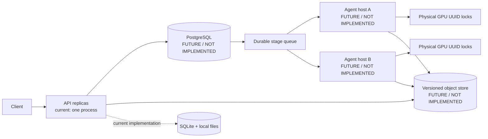

# Part 1：系统架构与部署设计

## 1. 评审边界：当前实现与演进设计

本仓库已经实现的是单台 Linux/WSL2 主机上的服务：FastAPI API、SQLite durable queue、本地持久化对象目录、一个 worker supervisor，以及同一台主机上可配置的物理 GPU 池。数据集声明范围是 100–1,000 张图；真实后端是 Stable Diffusion 1.5 attention LoRA，CPU tiny 后端只用于离线回归。依据见 [api.py](../src/lora_pipeline/api.py)、[store.py](../src/lora_pipeline/store.py)、[training.py](../src/lora_pipeline/training.py) 和 [config.py](../src/lora_pipeline/config.py)。

```
已实现：单主机 API + SQLite + 本地对象/制品 + 独立 worker + UUID GPU locks
未实现：多主机 PostgreSQL、版本化对象存储、跨主机 agents、DDP/模型并行
```

因此，“2–4 GPU concurrent”在本实现中表示同一台机器上 2–4 张真实、可由 `nvidia-smi` 发现且 UUID 唯一的物理卡；每个 GPU UUID 只有一个 OS lock 和一个同时运行的受管 stage。多个 job 可排队并发，但**一个 job 不会被假装成 DDP，也不会把一张卡复制成四张**。CPU fake slots 只在显式 test backend 下可用，不能作为真实 GPU 并发或质量结论。GPU 是否可用、显存和耗时必须由 [gpu_preflight.sh](../scripts/gpu_preflight.sh)、[cli.py](../src/lora_pipeline/cli.py) 和用户验收运行实际报告；仓库当前不声明已测得的 GPU 质量或吞吐。

Part 1 的生产演进边界如下（标注 FUTURE / NOT IMPLEMENTED 的组件是**未实现**，不是当前部署图）：



迁移不能只替换连接字符串：需要 PostgreSQL migration/租约事务、对象版本和 scoped authorization、远程 agent fencing/termination evidence，以及跨主机故障演练。当前实现明确共享故障域是本机和磁盘；详见[取舍记录](03-implementation-tradeoffs.md)。

## 2. 上传到部署/发布的数据流


[SVG](../diagrams/system-architecture.svg) · [PlantUML 源文件](../diagrams/system-architecture.puml)

1. 客户端用 configured Bearer key 创建 dataset metadata。`POST /v1/datasets` 只登记 name、size、SHA-256、MIME 和可选 caption；API 分配内部 file ID，文件名永远不参与路径拼接。
2. 客户端逐文件 `PUT` 原始字节。API 流式限制声明大小和 service limit，worker/store 再校验字节 SHA-256；`POST /complete` 原子冻结已上传对象并进入 `VERIFYING`。
3. worker 的 VERIFY 检查 store 中 dataset 是否仍为 `VERIFYING`、object 是否存在及其大小/摘要。随后 PREPARE 解码 JPEG/PNG/static WebP，EXIF/RGB/alpha 归一化，精确去重、感知近重复分组，并冻结不跨 group 的约 90/10 split。规范化输出是内容寻址 PNG：文件名含 pixel hash 前缀和最终 PNG bytes 的 SHA-256；旧 frozen manifest 引用的 image artifact 不覆盖。
4. CAPTION 先保留 user caption；缺失项按 profile 选择安全 template 或 BLIP，并把 trigger token、来源、模型 revision 写进 `training-input.json`。BLIP 的 CUDA 使用同一物理 GPU 资源池；template/CPU BLIP 只使用 CPU pool。
5. TRAIN 冻结输入 manifest 和基座 revision/fingerprint，冻结 VAE、text encoder、UNet 基座，仅优化 attention LoRA。在配置的 checkpoint 间隔、结束步或请求的停止步，完成 optimizer update 后保存 adapter、optimizer、scheduler、scaler（如适用）、RNG、global step、sample position 及兼容性身份；CLI 在 stderr 展示 progress，stdout 保留最终 JSON。
6. EVALUATE 重新加载保存的 adapter，先做技术 smoke，再用固定 prompt/seed/steps/guidance 生成 base 与 adapter 配对输出，计算 CLIP 等诊断。默认 `quality_policy` 为 null/未校准；因此技术成功可发布为 `COMPLETED_UNVERIFIED`，不能声称 READY。
7. PUBLISH 再次检查 store 中 active attempt、adapter/report/input checksum 和 test-only 标记，原子注册每 job 一个 model。只有技术成功、非 test-only 且配置了带 calibration reference 的 versioned policy 并全部 bounds 通过时才为 `READY`；下载未验证模型必须显式 `allow_unverified=true`。此处是 inference-ready LoRA artifact 的发布边界，不是在线推理服务。

## 3. 生命周期、状态与质量门禁


[SVG](../diagrams/job-lifecycle.svg) · [PlantUML 源文件](../diagrams/job-lifecycle.puml)

dataset 的 store 状态是 `UPLOADING → VERIFYING → COMPLETED | INVALID`。job 的 store 状态是 `ACCEPTED → RUNNING → (CANCEL_REQUESTED → CANCELLED) | FAILED | QUALITY_REJECTED | COMPLETED_UNVERIFIED | READY`；stage task 另有 `PENDING/RUNNING/RETRY_WAIT/SUCCEEDED/FAILED/CANCELLED`。工作流 stage 是 `PREPARE → CAPTION → TRAIN → EVALUATE → PUBLISH`，VERIFY 是 dataset 验证，不是 job stage。API `GET /v1/training-jobs/{id}` 同时返回 job 状态、stage 状态、attempt count 和最近 progress，因此不能只看 job 的 `RUNNING` 断言模型已训练完成。

质量 policy 只接受代码已实现的方向：`clip_prompt_score`、`heldout_similarity`、`diversity` 需要 `min` 和/或 `max`，`max_train_similarity` 通常通过 `max` 限制；实现不会替仓库虚构数值或默认 threshold。缺少 `version`、`calibration_reference` 或任何必需 bound 时是 `UNCALIBRATED`；一个完整 policy 中指标不可用或越界则是 `FAIL`，EVALUATE 后不创建 PUBLISH task。CLI/API 测试后端永远 test-only、永远不能 READY。实现和测试见 [evaluation.py](../src/lora_pipeline/evaluation.py) 与 [test_evaluation.py](../tests/test_evaluation.py)。

## 4. 资源公平、故障容错与限制


[SVG](../diagrams/lease-recovery.svg) · [PlantUML 源文件](../diagrams/lease-recovery.puml)

- scheduler 按 `EVALUATE → TRAIN → CAPTION → TRAIN` 权重循环、stage 内 owner round-robin、owner FIFO；有多个 owner 时，已有 GPU 工作的 owner 不会持续夺取新 slot。空闲卡可借用；不抢占运行中的 stage，也没有假想的独占 evaluation GPU。
- 每个物理 UUID 用共享 OS lock；supervisor 有 singleton lock。attempt 记录 fencing token、PID/start time/PGID、heartbeat、lease/deadline、checkpoint/output。失约时先确认精确进程已退出再复用 GPU；旧 token 的迟到结果无法提交。基础设施错误最多三次，OOM、输入不合格和质量拒绝不会悄悄换参数重训。
- API/worker 可在同一主机重启后依靠 SQLite 和本地文件恢复；磁盘或整机损坏不是容错的范围。生产部署必须把数据库和引用对象做一致备份；跨主机 HA 需上图中的未实现组件。
- 日志使用结构化事件，健康端点区分 liveness/readiness，metrics 需 admin key。进度在 stderr 与 task attempt progress 中保留；不可测指标写 `null`/`not_measured`，不写零。

## 5. 评审标准到证据

| 评审标准 | 当前证据与验收 artifact |
|---|---|
| ML architecture | frozen manifest、group split、LoRA-only、完整 resume、adapter reload、base/adapter paired evaluation；见 [training.py](../src/lora_pipeline/training.py)、[evaluation.py](../src/lora_pipeline/evaluation.py)。 |
| Distributed/production design | 单机 durable queue、attempt fencing、lease/heartbeat、GPU UUID locks、owner fairness；多机 PostgreSQL/object store/agent 仅为演进设计，明确未实现。 |
| 资源问题 | 2–4 张真实物理 GPU 各一 slot、共享 evaluation capacity、GPU 秒预算、CPU bounded pool；验收需收集 preflight、UUID、显存和并发日志，不以 fake slots 代替。 |
| Part 2 code/ML quality | `prepare → caption → train → evaluate` manifests、checkpoint/resume、CLIP/AB report、REST health/errors、Docker/test/benchmark runbook；见[技术规格](02-technical-specification.md)、[运行指南](04-running-and-api.md)、[性能定义](05-performance-benchmarks.md)。 |

完整交付导航和限制见[评审/作业指南](00-assignment-guide.md)；源码事实以该表中的文件和测试为准。
