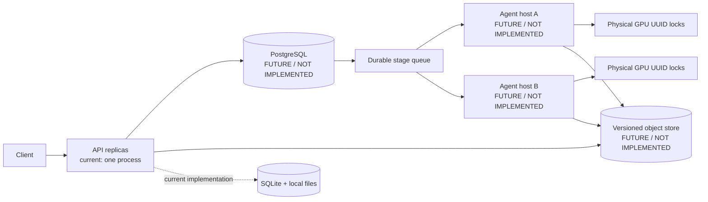
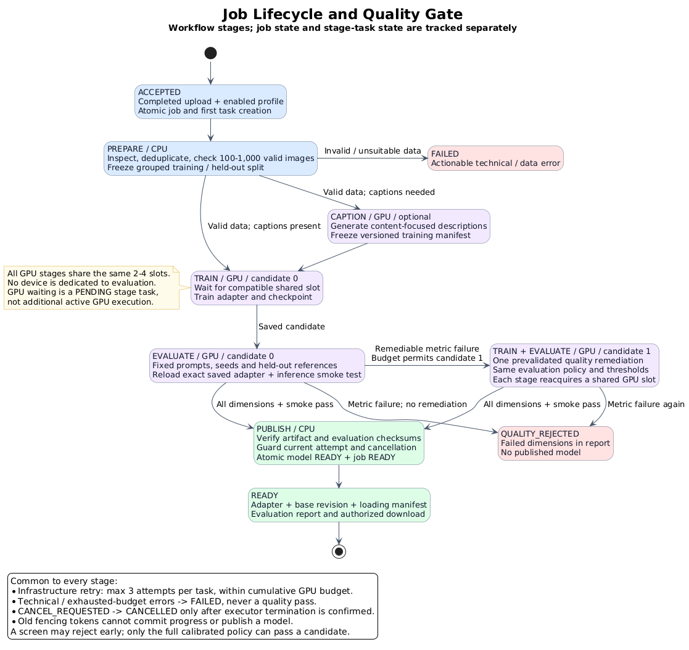
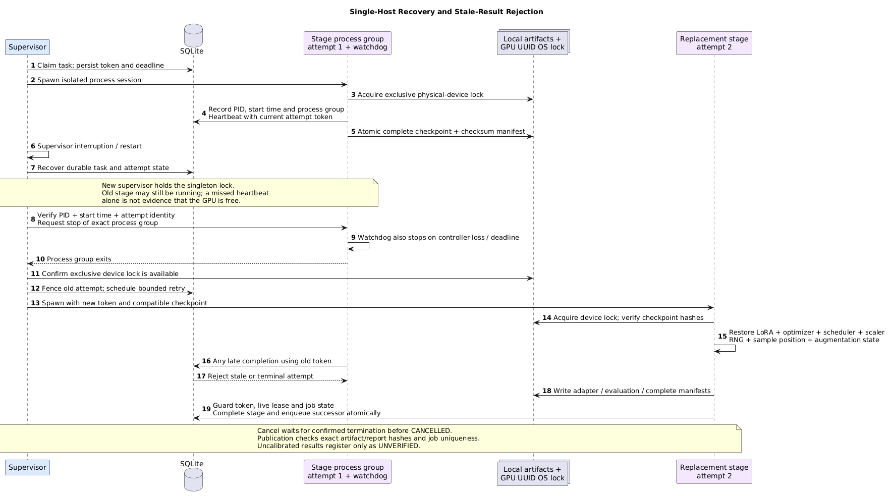

# Part 1 — System architecture and deployment design

## 1. Review boundary: implemented system versus evolution

The repository implements a service on one Linux/WSL2 host: a FastAPI API, a SQLite durable queue, local persistent object directories, one worker supervisor, and a configurable pool of physical GPUs on that host. The declared dataset range is 100–1,000 images; the real backend is Stable Diffusion 1.5 attention LoRA, while the CPU tiny backend is offline regression only. Evidence: [api.py](../src/lora_pipeline/api.py), [store.py](../src/lora_pipeline/store.py), [training.py](../src/lora_pipeline/training.py), and [config.py](../src/lora_pipeline/config.py).

```
Implemented: single-host API + SQLite + local objects/artifacts + worker + UUID GPU locks
Not implemented: multi-host PostgreSQL, versioned object storage, remote agents, DDP/model parallelism
```

Here “2–4 GPU concurrent” means 2–4 real physical cards on one host, discovered by `nvidia-smi`, with unique UUIDs. Each UUID has one OS lock and at most one managed stage at a time. Multiple jobs may be queued concurrently, but **one job is not presented as DDP and one card is never multiplied into four**. CPU fake slots are available only with the explicit test backend; they are not evidence of CUDA concurrency or quality. GPU availability, memory and timing must come from [gpu_preflight.sh](../scripts/gpu_preflight.sh), [cli.py](../src/lora_pipeline/cli.py), and an actual acceptance run; this repository does not claim measured GPU quality or throughput.

The Part 1 production evolution boundary is shown below (components labelled FUTURE / NOT IMPLEMENTED are **not implemented**, not part of the current deployment):



Migration is more than changing a connection string: it needs PostgreSQL migrations/lease transactions, object versions and scoped authorization, remote-agent fencing/termination evidence, and cross-host failure drills. The current shared failure domain is the host and its disk; see the [decision record](03-implementation-tradeoffs.md).

## 2. Upload-to-publication data flow


[SVG](../diagrams/system-architecture.svg) · [PlantUML source](../diagrams/system-architecture.puml)

1. A client uses a configured Bearer key to create dataset metadata. `POST /v1/datasets` records only name, size, SHA-256, MIME and an optional caption; the API assigns an internal file ID, and filenames are never concatenated into paths.
2. The client streams each raw file with `PUT`. The API enforces declared and service limits; worker/store validates the byte SHA-256 again. `POST /complete` atomically freezes uploaded objects and enters `VERIFYING`.
3. VERIFY checks that the store dataset is still `VERIFYING`, and that each object exists with the recorded size/digest. PREPARE decodes JPEG/PNG/static WebP, normalizes EXIF/RGB/alpha, removes exact duplicates, groups perceptual near-duplicates, and freezes a group-exclusive approximately 90/10 split. Normalized output is a content-addressed PNG: the name contains a pixel-hash prefix and the final PNG-byte SHA-256; an image artifact referenced by an existing frozen manifest is never overwritten.
4. CAPTION preserves supplied user captions. Missing entries use the selected safe template or BLIP backend, recording the trigger token, source and model revision in `training-input.json`. CUDA BLIP uses the same physical-GPU pool; template/CPU BLIP uses the bounded CPU pool.
5. TRAIN freezes the input manifest and base revision/fingerprint, freezes the VAE, text encoder and UNet base, and optimizes attention LoRA only. At the configured checkpoint interval, final step or requested stop step, it commits adapter, optimizer, scheduler, applicable scaler, RNG, global step, sample position and compatibility identity after an optimizer update. CLI progress goes to stderr while stdout carries the final JSON.
6. EVALUATE reloads the saved adapter, performs a technical smoke test, then generates paired base/adapter outputs with fixed prompts/seeds/steps/guidance and computes CLIP diagnostics. The default `quality_policy` is null/uncalibrated; technical success therefore may publish as `COMPLETED_UNVERIFIED`, never as an implied READY.
7. PUBLISH rechecks the store's active attempt, adapter/report/input checksums and test-only marker, then atomically registers one model per job. `READY` requires technical success, a non-test backend, a versioned policy with a calibration reference, and passing bounds. Downloading an unverified model requires explicit `allow_unverified=true`. This is the inference-ready LoRA artifact boundary, not an online inference server.

## 3. Lifecycle, states and quality gates



[SVG](../diagrams/job-lifecycle.svg) · [PlantUML](../diagrams/job-lifecycle.puml)

Dataset store states are `UPLOADING → VERIFYING → COMPLETED | INVALID`. Job states are `ACCEPTED → RUNNING → (CANCEL_REQUESTED → CANCELLED) | FAILED | QUALITY_REJECTED | COMPLETED_UNVERIFIED | READY`; stage tasks additionally use `PENDING/RUNNING/RETRY_WAIT/SUCCEEDED/FAILED/CANCELLED`. The workflow stages are `PREPARE → CAPTION → TRAIN → EVALUATE → PUBLISH`; VERIFY is dataset verification, not a job stage. `GET /v1/training-jobs/{id}` returns job state, stage state, attempt counts and recent progress, so `RUNNING` alone never proves that a model has finished training.

The policy directions implemented in code are explicit: `clip_prompt_score`, `heldout_similarity` and `diversity` require `min` and/or `max`; `max_train_similarity` is commonly constrained with `max`. No measured values or default thresholds are invented here. Missing `version`, `calibration_reference` or required bounds produce `UNCALIBRATED`; an unavailable metric or out-of-bound metric in an otherwise complete policy produces `FAIL`, and EVALUATE does not enqueue PUBLISH. CLI/API test backends are always test-only and can never be READY. See [evaluation.py](../src/lora_pipeline/evaluation.py) and [test_evaluation.py](../tests/test_evaluation.py).

## 4. Fair resources, recovery and limits



[SVG](../diagrams/lease-recovery.svg) · [PlantUML](../diagrams/lease-recovery.puml)

- The scheduler uses the weighted `EVALUATE → TRAIN → CAPTION → TRAIN` cycle, owner round-robin within a stage, and owner-local FIFO. When multiple owners have work, an owner with active GPU work cannot keep taking every new slot. Idle cards may be borrowed; running stages are not preempted and no fictional dedicated evaluation GPU is reserved.
- Each physical UUID has a shared OS lock; the supervisor has a singleton lock. Attempts record fencing token, PID/start time/PGID, heartbeat, lease/deadline and checkpoint/output. On expiry, the exact process must be confirmed stopped before reuse; a late result with an old token cannot commit. Infrastructure errors have at most three attempts; OOM, unsuitable data and quality rejection do not silently change parameters or retrain.
- API and worker restarts recover persistent state on the same host through SQLite and local files. Disk or host loss is outside the fault boundary. Production deployment must take a consistent backup of the database and referenced objects; cross-host HA requires the future components above.
- Logs are structured events; health endpoints distinguish liveness/readiness; metrics require an admin key. Progress is retained in stderr and task-attempt progress. Unmeasurable values are `null`/`not_measured`, never zero.

## 5. Review criteria and evidence

| Review criterion | Current evidence and acceptance artifact |
|---|---|
| ML architecture | Frozen manifests, group split, LoRA-only optimization, complete resume, adapter reload and paired base/adapter evaluation; see [training.py](../src/lora_pipeline/training.py) and [evaluation.py](../src/lora_pipeline/evaluation.py). |
| Distributed/production design | Single-host durable queue, attempt fencing, lease/heartbeat, UUID GPU locks and owner fairness; multi-host PostgreSQL/object store/agents are explicitly future design, not implemented. |
| Resource problem solving | One slot per real physical GPU, shared evaluation capacity, GPU-second budget and bounded CPU pool; acceptance must collect preflight, UUID, memory and concurrency logs, not substitute fake slots. |
| Part 2 code/ML quality | `prepare → caption → train → evaluate` manifests, checkpoint/resume, CLIP/AB report, REST health/errors, Docker/test/benchmark runbook; see the [technical specification](02-technical-specification.md), [run guide](04-running-and-api.md), and [performance definitions](05-performance-benchmarks.md). |

The [review/assignment guide](00-assignment-guide.md) maps every deliverable to code, tests, artifacts and limitations; source files and tests are the authority for implementation claims.
