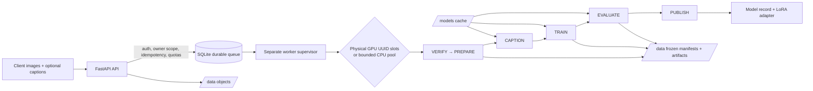
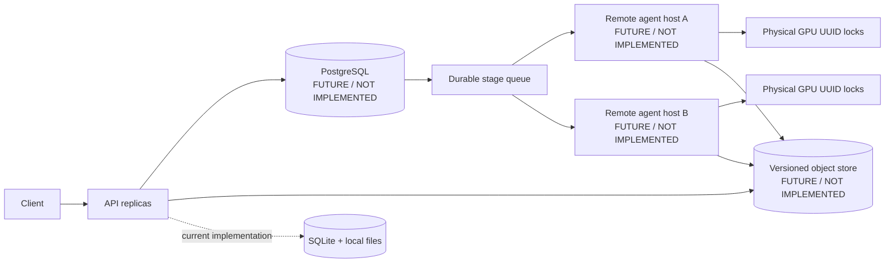

# Docker CLI training and GPU acceptance guide

[English quick start](../README.md) · [中文简洁入口](../README_ZH.md) · [Web Studio guide](06-web-studio.md)

This is the full Docker command-line runbook for real-GPU acceptance: preflight, data preparation and captioning, immutable model pinning, train/resume, evaluation, API operation, and benchmarks. For the guided browser workflow, use the [Web Studio guide](06-web-studio.md). Every real GPU Compose command in this guide uses both `compose.yaml` and `compose.gpu.yaml`.

This repository implements a durable **single-host** pipeline for turning a user dataset of **100–1,000 images** into an inference-ready Stable Diffusion 1.5 attention-LoRA artifact. It covers upload, verification, preprocessing, captioning, group-aware splitting, LoRA training with resume, evaluation, publication, and controlled download.

The implementation runs a FastAPI service and a separate worker on one Linux/WSL2 host. SQLite and local persistent directories provide the durable queue and artifact store; the worker schedules one managed slot per physical GPU UUID. A target host with two to four physical GPUs can therefore run two to four independent jobs concurrently. This does **not** mean DDP/model-parallel training, and it does not turn one GPU into multiple simulated production slots.

The real training backend is `local-sd15-v1` (Stable Diffusion 1.5). `local-tiny-v1`, CPU smoke tests, and fake slots are strictly offline regression tools: they demonstrate orchestration and contracts, not CUDA capacity, SD 1.5 quality, or GPU performance.

> Evidence rule: source code and current tests are authoritative. Docker daemon, target-GPU, real SD 1.5/IBean, quality, and benchmark results that were not actually run must remain `null` / `not_measured`; this guide intentionally does not invent them.

## Reviewer navigation

| Need | Start here |
| --- | --- |
| Assignment requirements mapped to source, tests, artifacts, and limits | [Assignment review guide](00-assignment-guide.md) |
| Part 1 architecture, lifecycle, scheduling, recovery, and production evolution | [System architecture](01-system-architecture.md) |
| API schemas, artifacts, state machine, errors, and CLI contracts | [Technical specification](02-technical-specification.md) |
| Deliberate single-host trade-offs and reliability boundary | [Decision record](03-implementation-tradeoffs.md) |
| Docker/CPU/API operations and acceptance details | [Running and API guide](04-running-and-api.md) |
| Benchmark protocol, 2–4 GPU experiment, metrics, and report template | [Performance benchmark guide](05-performance-benchmarks.md) |
| Historical validation record (not a claim about the current checkout) | [VALIDATION.md](../VALIDATION.md) |

The Chinese version of this detailed guide is [docs/07-docker-cli-training.md](../docs/07-docker-cli-training.md). The linked English documents contain the complete contracts and acceptance rationale.

## Assignment coverage and evidence

| Assignment criterion | Current implementation and evidence | Acceptance boundary |
| --- | --- | --- |
| **Part 1 — upload through deployment/publication for 100–1,000 images** | [API](../src/lora_pipeline/api.py), [data pipeline](../src/lora_pipeline/data.py), [worker](../src/lora_pipeline/worker.py), [store](../src/lora_pipeline/store.py), and end-to-end/service-contract tests | Files are streamed and checksummed; VERIFY, preparation, training, and evaluation artifacts must bind before PUBLISH. The result is an inference-ready LoRA artifact, not an online serving deployment. |
| **Part 1 — 2–4 physical GPUs, fairness, fault tolerance, scalability** | UUID GPU locks, bounded CPU pool, weighted scheduler, owner rotation, leases/heartbeats/fencing, atomic publication; [scheduler/recovery tests](../tests/test_scheduler_recovery.py) | Current scope is multiple independent cards on one host, one slot each. Host/disk loss is outside the recovery guarantee. PostgreSQL, versioned object storage, remote agents, and multi-host HA are future design only. |
| **Part 1 — ML pipeline, API/schema/errors, production boundary** | Separate API/store/worker/data/caption/training/evaluation modules; OpenAPI at runtime; structured errors and observability tests | POST mutation idempotency is route/body scoped. PUT uploads retry by file ID and checksum. HTTP validation errors and application errors intentionally have different shapes. |
| **Part 2 — data processing** | JPEG/PNG/static WebP decode, EXIF/RGB/alpha normalization, exact and perceptual-near deduplication, group-exclusive split, caption priority, warning filters | The normalized PNG is addressed by its final encoded-byte SHA-256. Minimum unique/train/validation/group gates reject unsuitable data; blur/contrast are warnings rather than invented quality rejection. |
| **Part 2 — configurable LoRA training** | SD 1.5 attention LoRA, frozen base modules, profile/config validation, FP16/gradient checkpointing, checkpoint/resume, stderr progress | Checkpoints include adapter, optimizer, scheduler, scaler when applicable, RNG, cursor, and compatibility identity. OOM does not silently change parameters. |
| **Part 2 — evaluation and quality policy** | Technical adapter reload, fixed-condition base/adapter pairs, CLIP diagnostics, paired A/B comparison, configurable policy | CLIP is a diagnostic proxy, not FID or proof of subjective style quality. Missing calibration/bounds is `UNCALIBRATED`; a complete policy with a missing runtime metric or failed bound is `FAIL`. |
| **Part 2 — REST, Docker, tests, benchmarks** | Health/readiness/metrics, structured logs, Docker/Compose, pytest/Ruff/mypy guidance, benchmark protocol | Python/CPU regression cannot substitute for Docker, real GPU, quality, or capacity evidence. Report unrun work as `not_measured`. |

The compact, test-by-test evidence matrix is in the [assignment review guide](00-assignment-guide.md). It is the best starting point for a graded review.

## Architecture and explicit implementation boundary



The data path is:

1. `POST /v1/datasets` records declared file metadata; the API assigns IDs and never concatenates client filenames into server paths.
2. `PUT` streams each file while size and SHA-256 are checked. `POST /complete` freezes the upload and enters `VERIFYING`.
3. VERIFY and PREPARE validate stored bytes, decode supported images, normalize EXIF/RGB/alpha, deduplicate, form near-duplicate groups, and freeze an approximately 90/10 group-exclusive train/validation split.
4. CAPTION retains user captions first; missing captions use a safe template or the configured BLIP backend. The trigger token, source, and model revision are frozen into `training-input.json`.
5. TRAIN freezes the input manifest and base revision/fingerprint, optimizes attention LoRA only, and writes complete checkpoint state at configured boundaries.
6. EVALUATE reloads the adapter, performs a technical smoke test, creates paired base/adapter outputs with fixed conditions, and writes CLIP diagnostics and a quality-policy outcome.
7. PUBLISH rechecks active-attempt fencing and artifact checksums, then atomically registers one model record. A download is an inference-ready LoRA artifact, not a live inference service.

### What is implemented now

- One host: FastAPI, SQLite, local persistent objects/artifacts, and one worker supervisor.
- Real physical GPU UUID discovery/locking, one managed slot per card, or an explicitly bounded CPU pool.
- Durable attempt state, lease heartbeat, fencing token, process identity, cancellation, bounded infrastructure retries, and atomic artifact/model publication.
- Weighted stage scheduling (`EVALUATE → TRAIN → CAPTION → TRAIN`), owner round-robin within a stage, owner-local FIFO, idle-card borrowing, and non-preemptive running work.
- Restart recovery on the same host and disk. A stale attempt cannot commit after its fencing token is superseded.

### Future multi-host design — not implemented



Moving to multi-host operation needs more than changing a database URL: PostgreSQL migrations and lease transactions, versioned/scoped object storage, remote-agent fencing/termination proof, and cross-host failure drills. The detailed boundary is in the [system architecture](01-system-architecture.md) and [decision record](03-implementation-tradeoffs.md).

## Data, artifacts, and quality gates

The supported upload formats are JPEG, PNG, and non-animated WebP. Default limits are one image up to 20 MiB / 40 MP with a minimum side of 256 pixels, and a dataset of 100–1,000 images / 2 GiB. Preparation rejects corrupt, unsupported, oversized, animated, or exact-duplicate input. Perceptual near-duplicates stay in the same split group; the frozen split requires the minimum valid unique images, train/validation counts, and group counts. Training uses aspect-preserving resize plus center crop by default; random crop and horizontal flip must be explicitly set in the training configuration, and validation has no random augmentation.

Normalized artifacts are written as content-addressed PNGs whose identity includes a pixel-hash prefix and the SHA-256 of the **final encoded PNG bytes**. A later preparation run must not overwrite an image referenced by an existing frozen manifest. If frozen image checksums fail, rebuild/redeploy the current code and rerun prepare+caption; do not edit the manifest or bypass the check.

The reproducibility lineage is:

```text
dataset/file IDs
  → prepared.json
  → training-input.json
  → training-result.json + checkpoint + adapter.safetensors
  → evaluation.json + evaluation.html + paired outputs
  → published model record
```

An inference-ready artifact binds the adapter and SHA-256, base model revision/fingerprint, trigger token, inference configuration, and evaluation report. It is neither automatically `READY` nor online serving. With the default null quality policy, a technically successful real run becomes `COMPLETED_UNVERIFIED`; downloading it requires `allow_unverified=true`.

## Quick start: local Python and CPU regression

Python 3.12 is required. This path is for offline regression and does not validate a GPU workflow.

```bash
python3.12 -m venv /tmp/lora-pipeline-venv
source /tmp/lora-pipeline-venv/bin/activate
python -m pip install -U pip
python -m pip install -e '.[dev]'
python -m lora_pipeline preflight

export LORA_API_KEYS='{"demo-token":"owner-a"}'
export LORA_ADMIN_KEYS='["admin-token"]'
export LORA_TEST_BACKEND=1
export LORA_FAKE_SLOTS=1
export HF_HUB_OFFLINE=1
export TRANSFORMERS_OFFLINE=1
python -m lora_pipeline cpu-smoke --output var/smoke-cpu
python -m pytest -q
```

CPU smoke generates 120 synthetic images, checkpoints at step 2, resumes to step 4, reloads the adapter, and performs a technical evaluation. Its expected result is permanently test-only with `quality_status=UNCALIBRATED`; it is useful for regressions in orchestration, gradients, resume, adapter loading, and HTTP contracts only.

For the current test list and coverage, inspect [tests/](../tests/) and the [test-file index](00-assignment-guide.md#test-file-index). The historical count in [VALIDATION.md](../VALIDATION.md) is not a current-run result.

## GPU Docker acceptance runbook

The target host needs Linux/WSL2, Docker Engine with Compose v2, an NVIDIA driver, and NVIDIA Container Toolkit. The GPU Compose overlay installs CUDA PyTorch, disables the test backend/fake slots, and requests GPUs only for `worker`; `api` does not require CUDA. `pipeline-data` persists SQLite, uploads, manifests, checkpoints, adapters, and reports. `model-cache` persists model weights.

Define this helper in every new Bash shell (`dc` is a function, not a Docker subcommand):

```bash
dc() { docker compose -f compose.yaml -f compose.gpu.yaml "$@"; }
dc config --quiet
docker buildx version
dc build --progress=plain
dc run --rm --no-deps worker lora-pipeline preflight
```

If Docker requires elevation, put `sudo docker compose ...` inside the function body; `sudo dc ...` does not invoke a shell function. Stop if preflight does not show `cuda_available`, the intended physical UUIDs, and usable memory. Optionally restrict schedulable GPUs with `LORA_GPU_UUIDS` in `.env`.

One-shot data/training/evaluation containers share container path `/data` through the named `pipeline-data` volume. It is not host `/data`; `--rm` removes the container but retains its volume artifacts. Run modules 1–3 sequentially and do not also run the resident worker against the same GPU. The API/worker service pair starts only for the REST module.

### IBean-999 acceptance dataset

The repository's recommended reproducible acceptance input is a local 999-image IBean subset: 333 images each from `healthy`, `angular_leaf_spot`, and `bean_rust`, with captions in `datasets/ibean/images/captions.json`. It satisfies the 100–1,000 image range and input-size gate, and supports decoding, splitting, captions, checkpointing, evaluation, and resource-use validation. It is **not** a calibrated style-quality benchmark.

The source archive is the IBean training archive (1,034 source images, MIT license); its SHA-256 is:

```text
284fe8456ce20687f4367ae7ad94a64577e7f9fde2c2c6b1c74340ab5dc82715
```

For a fresh target host, obtain the archive from the upstream [IBean project](https://github.com/AI-Lab-Makerere/ibean) or an approved mirror, verify that checksum before extraction, then select 333 JPEGs per class and generate captions:

```bash
python - <<'PY'
import json
import shutil
from pathlib import Path

raw = Path("datasets/ibean/raw/train")
out = Path("datasets/ibean/images")
out.mkdir(parents=True, exist_ok=True)
phrases = {
    "healthy": "healthy bean leaf",
    "angular_leaf_spot": "bean leaf with angular leaf spot",
    "bean_rust": "bean leaf with bean rust",
}
captions = {}
for label, phrase in phrases.items():
    for source in sorted((raw / label).glob("*.jpg"))[:333]:
        target = out / f"{label}__{source.name}"
        shutil.copy2(source, target)
        captions[target.name] = f"a close-up photograph of a {phrase}"
(out / "captions.json").write_text(json.dumps(captions, indent=2) + "\n")
print(f"prepared {len(captions)} images")
PY
```

The pipeline itself does not require this particular data. Respect upstream dataset/image terms before public or commercial use.

### 1. Prepare and caption real input

Mount the host dataset read-only, preserve its source filenames/MIME types, and make file metadata only after checking the 100–1,000 bound. `captions.json`, when present, maps source filename to supplied caption; otherwise template captions may be used.

```bash
export DATASET_DIR="${DATASET_DIR:-$PWD/datasets/ibean/images}"
test -d "$DATASET_DIR" || { echo "DATASET_DIR does not exist: $DATASET_DIR" >&2; exit 1; }

dc run --rm --no-deps -i -T -v "$DATASET_DIR:/input:ro" worker python - <<'PY'
import json
from pathlib import Path

root = Path("/input")
captions = json.loads((root / "captions.json").read_text()) if (root / "captions.json").exists() else {}
paths = sorted(p for p in root.iterdir() if p.is_file() and p.suffix.lower() in {".jpg", ".jpeg", ".png", ".webp"})
if not 100 <= len(paths) <= 1000:
    raise SystemExit(f"expected 100..1000 images, found {len(paths)}")
items = [{"id": f"input-{i:04d}", "name": p.name, "path": str(p), "caption": captions.get(p.name)} for i, p in enumerate(paths)]
Path("/data/real-files.json").write_text(json.dumps(items))
PY

export DATA_PREPARATION_STARTED="$(date +%s)"
dc run --rm --no-deps -v "$DATASET_DIR:/input:ro" worker \
  lora-pipeline prepare --files /data/real-files.json --output /data/real-prepared
export DATA_PREPARATION_SECONDS="$(( $(date +%s) - DATA_PREPARATION_STARTED ))"
dc run --rm --no-deps worker \
  lora-pipeline caption --prepared /data/real-prepared/prepared.json \
  --output /data/real-input --mode template --trigger-token mystyle
```

`prepared.json` and `training-input.json` are the frozen evidence for accepted/rejected images, warnings, groups, split, captions, and hashes. Template/CPU BLIP work uses the bounded CPU pool; CUDA BLIP shares the real GPU pool.

### 2. Pin the base model, then train and resume

Warm the cache while online once. Capture the immutable revision that was resolved, then use `local_files_only=true` for training and resume. This prevents an upstream default branch from changing the base model between runs and keeps download time separate from training measurement. Do not place an HF token in a config, image, or README; pass it only to the one-time cache-warming container if required.

```bash
dc run --rm --no-deps -i -T -v "$PWD/configs:/workspace/configs:ro" worker python - <<'PY'
import json
from pathlib import Path
from huggingface_hub import snapshot_download

repo = "stable-diffusion-v1-5/stable-diffusion-v1-5"
root = Path(snapshot_download(repo_id=repo))
revision = root.name
if len(revision) < 7:
    raise RuntimeError("snapshot did not resolve to an immutable commit")
config = json.loads(Path("/workspace/configs/sd15-smoke.json").read_text())
config.update({"model_name": repo, "revision": revision, "local_files_only": True})
Path("/data/sd15-smoke-pinned.json").write_text(json.dumps(config, indent=2) + "\n")
print(json.dumps({"revision": revision, "config": "/data/sd15-smoke-pinned.json"}))
PY

dc run --rm --no-deps -v "$PWD/configs:/workspace/configs:ro" worker \
  lora-pipeline train --input /data/real-input/training-input.json \
  --config /data/sd15-smoke-pinned.json --output /data/sd15-smoke-training \
  --stop-after-step 5
dc run --rm --no-deps -v "$PWD/configs:/workspace/configs:ro" worker \
  lora-pipeline train --input /data/real-input/training-input.json \
  --config /data/sd15-smoke-pinned.json --output /data/sd15-smoke-training \
  --resume /data/sd15-smoke-training/checkpoints/step-00000005/checkpoint.json
```

`configs/sd15-smoke.json` is a 512px, batch-1, accumulation-4, rank/alpha-4, FP16, gradient-checkpointing, 10-step functional configuration—not a quality or throughput benchmark. Batch accumulation distinguishes microsteps from optimizer steps. The CLI emits progress to stderr and final machine-readable JSON to stdout. `training-result.json` records the adapter checksum, input hash, base revision/fingerprint, configuration, trainable-parameter counts, and elapsed time.

`BASE_MODEL_UNAVAILABLE`, `CHECKPOINT_INCOMPATIBLE`, `CHECKPOINT_CORRUPT`, and `GPU_OUT_OF_MEMORY` are distinct failures. Fix cache/network/credentials/disk, compatibility/corruption, or configuration respectively; training never silently reduces configuration after an OOM.

### 3. Evaluate and compare A/B candidates

Evaluation reloads the saved adapter, runs a technical smoke test, generates fixed-condition base/adapter pairs, and computes available CLIP diagnostics. It outputs `evaluation.json`, HTML, paired outputs, and a quality status; it does not produce FID. The default null policy makes a technically successful evaluation `UNCALIBRATED`, not an implicit quality pass.

```bash
dc run --rm --no-deps -v "$PWD/configs:/workspace/configs:ro" worker \
  lora-pipeline evaluate \
  --training-result /data/sd15-smoke-training/training-result.json \
  --input /data/real-input/training-input.json --output /data/sd15-smoke-evaluation \
  --config /workspace/configs/evaluation-smoke.json
```

To compare two candidates, train both against the same frozen input and use `lora-pipeline compare` with the same prompt, seed, resolution, steps, and guidance configuration:

```bash
dc run --rm --no-deps -i -T worker python - <<'PY'
import json
from pathlib import Path

config = json.loads(Path("/data/sd15-smoke-pinned.json").read_text())
config["learning_rate"] = 0.0002
Path("/data/sd15-smoke-b.json").write_text(json.dumps(config))
PY
dc run --rm --no-deps worker lora-pipeline train \
  --input /data/real-input/training-input.json --config /data/sd15-smoke-b.json \
  --output /data/sd15-smoke-training-b
dc run --rm --no-deps -v "$PWD/configs:/workspace/configs:ro" worker \
  lora-pipeline compare --left /data/sd15-smoke-training/training-result.json \
  --right /data/sd15-smoke-training-b/training-result.json \
  --input /data/real-input/training-input.json --output /data/sd15-smoke-ab \
  --config /workspace/configs/evaluation-smoke.json
```

A calibrated, versioned policy with a calibration reference and required bounds is necessary before a non-test result can reach `READY`; code does not validate external calibration evidence.

### 4. Start REST services and inspect operational evidence

```bash
dc up -d api worker
dc ps
curl --fail --silent http://127.0.0.1:8000/health/live
curl --silent --show-error http://127.0.0.1:8000/health/ready
curl --fail --silent -H "Authorization: Bearer $DEMO_TOKEN" http://127.0.0.1:8000/metrics
dc logs --tail=200 api worker
```

`/health/live` confirms that the API responds. `/health/ready` evaluates database, storage, and worker state and may return 503 briefly on startup. `/metrics` needs an admin key. Logs are structured and are designed not to record tokens, captions, or image content.

`dc down` keeps named volumes. `dc down -v` deletes the database, checkpoints, adapters, and model cache; export required artifacts first.

## REST API: minimal client flow

Run the API and worker as separate processes outside Compose, or use the Compose services above:

```bash
export LORA_API_KEYS='{"demo-token":"owner-a"}'
export LORA_ADMIN_KEYS='["admin-token"]'
python -m lora_pipeline api --host 127.0.0.1 --port 8000
# In another terminal:
python -m lora_pipeline worker
```

The minimal flow is:

1. `POST /v1/datasets` with file name, size, SHA-256, MIME type, and optional caption for every planned file. Supply `Idempotency-Key`.
2. Stream each file to its returned `PUT /v1/datasets/{dataset_id}/files/{file_id}` endpoint. A successful upload returns 204; PUT is verified by its file ID, declared size, and SHA-256 rather than a generic idempotency table.
3. `POST /v1/datasets/{dataset_id}/complete` with `Idempotency-Key`, then poll the dataset until it is `COMPLETED` or `INVALID`.
4. Read `GET /v1/training-profiles`; select `profile_revision_id: "local-sd15-v1"` for real work. `local-tiny-v1` appears only when the test backend is explicitly enabled.
5. `POST /v1/training-jobs` with the completed dataset ID, profile revision ID, trigger token, and bounded optional overrides. Poll `GET /v1/training-jobs/{job_id}` and its `/evaluation` endpoint.
6. Download `GET /v1/models/{model_id}/download`. Non-READY results require `allow_unverified=true` explicitly.

For example, job creation returns `202 Accepted` and begins in `ACCEPTED` / `PREPARE`:

```bash
DATASET_ID='completed-dataset-id'
JOB_ID='job-id'
curl -sS -X POST http://127.0.0.1:8000/v1/training-jobs \
  -H 'Authorization: Bearer demo-token' \
  -H 'Content-Type: application/json' \
  -H 'Idempotency-Key: job-001' \
  -d "{\"dataset_id\":\"$DATASET_ID\",\"profile_revision_id\":\"local-sd15-v1\",\"trigger_token\":\"mystyle\"}"
curl -sS -H 'Authorization: Bearer demo-token' \
  "http://127.0.0.1:8000/v1/training-jobs/$JOB_ID"
```

Dataset states are `UPLOADING → VERIFYING → COMPLETED | INVALID`. Job terminal states are `READY`, `COMPLETED_UNVERIFIED`, `FAILED`, `QUALITY_REJECTED`, and `CANCELLED`; stage tasks additionally track `PENDING`, `RUNNING`, `RETRY_WAIT`, `SUCCEEDED`, `FAILED`, and `CANCELLED`. `RUNNING` never on its own proves a published model exists.

Every mutating POST—dataset creation, completion, job creation, and cancellation—requires `Idempotency-Key`, scoped to owner + concrete method/path + key and bound to the body hash. An identical request replays its original response; a changed body returns `IDEMPOTENCY_KEY_REUSED`. Owner isolation returns 404 for another owner's resource.

Application-raised `PipelineError` responses use `error.code`, `error.message`, `error.retryable`, `error.details`, `error.request_id`, and `X-Request-ID`. FastAPI/Pydantic request validation happens before application routing and deliberately remains `422 {"detail":[...]}`. CLI failures instead emit their structured error to stderr and use a nonzero exit; successful CLI JSON stays on stdout. See the [technical specification](02-technical-specification.md#5-rest-api-idempotency-and-schema) for the full schema.

`scripts/api_demo.py` is a synthetic-PNG/tiny regression example, not an IBean GPU acceptance client, benchmark, or quality result. A real client must preserve source MIME types, use `local-sd15-v1`, set mutation idempotency keys, and keep dataset/job timeouts separate.

## Docker-internal tests and CPU technical path

The runtime image does not include pytest, Ruff, or Mypy. This command mounts the source read-only, creates a temporary virtual environment in `/tmp`, and downloads development tools from PyPI. It does not validate a GPU:

```bash
dc run --rm --no-deps -e HF_HUB_OFFLINE=1 -e TRANSFORMERS_OFFLINE=1 \
  -v "$PWD:/workspace:ro" -w /workspace api sh -lc '
    python -m venv --system-site-packages /tmp/lora-dev &&
    /tmp/lora-dev/bin/pip install --no-cache-dir "pytest==8.4.2" "ruff==0.13.2" "mypy==1.18.2" "types-Pillow" "types-psutil" &&
    /tmp/lora-dev/bin/python -m pytest -p no:cacheprovider -q &&
    /tmp/lora-dev/bin/python -m ruff check --no-cache src tests scripts/api_demo.py &&
    /tmp/lora-dev/bin/python -m mypy --cache-dir=/tmp/mypy-cache
  '
```

Without a GPU, use the default Compose file (not `dc`) with the test backend/fake slot values from `.env.example`:

```bash
docker compose run --rm --no-deps worker \
  lora-pipeline cpu-smoke --output /data/cpu-smoke
```

Prefix this command with `sudo` when Docker socket access requires it. The smoke run creates synthetic PNGs, checkpoints at step 2, resumes to step 4, and reloads the adapter. The result is permanently `test_only=true` with `quality_status=UNCALIBRATED`; it is a regression check only.

## Maintenance and build troubleshooting

`dc down` preserves named volumes, and `dc up -d` can restore services and artifacts. `docker compose down -v` deletes the database, checkpoints, adapters, and model cache; export anything required with `dc cp` first. GPU lifecycle commands use `dc`.

If `docker compose build` times out while retrieving `python:3.12-slim-bookworm` metadata, the Dockerfile has not started yet. Check Docker daemon egress, proxy, and DNS before retrying. For `GPU_UNAVAILABLE`, rerun preflight and check the driver, NVIDIA Container Toolkit, overlay, and `LORA_GPU_UUIDS`. For `GPU_OUT_OF_MEMORY`, reduce resolution/rank/batch or raise gradient accumulation, then record the changed configuration before measuring again.

If failure occurs during Dockerfile `pip install` and mentions `files.pythonhosted.org`, `ReadTimeoutError`, or a pip subprocess, the base image pulled successfully and PyPI dependency download failed. `PIP_INDEX_URL` is independent from `TORCH_INDEX_URL`; its defaults are a 300-second timeout and 10 retries. BuildKit cache mounts retain successfully downloaded wheels/HTTP responses, so do not add `--no-cache` for an ordinary retry. First verify BuildKit and daemon access to PyPI, then rebuild with the permission model that matches the host:

```bash
# Current user can access the Docker socket:
dc build --progress=plain

# Current user requires sudo for Docker:
sudo docker run --rm python:3.12-slim-bookworm \
  python -c 'import urllib.request; print(urllib.request.urlopen("https://pypi.org/simple/", timeout=30).status)'
sudo docker compose -f compose.yaml -f compose.gpu.yaml build --progress=plain
```

If the default PyPI endpoint is unsuitable for the network, choose an approved mirror and change only the application dependency source. CPU/GPU PyTorch wheels remain selected by Compose through `TORCH_INDEX_URL` / `TORCH_INDEX_URL_GPU`. `PIP_INDEX_URL` is a build argument and can appear in build metadata, so it must not contain usernames, passwords, or tokens; authenticated mirrors require BuildKit secrets and are out of scope here.

```bash
# Use only a mirror approved for this environment.
export PIP_INDEX_URL='https://your-approved-pypi-mirror/simple'
dc build --progress=plain

# sudo may not retain exported variables, so pass them explicitly.
sudo env PIP_INDEX_URL='https://your-approved-pypi-mirror/simple' \
  docker compose -f compose.yaml -f compose.gpu.yaml build --progress=plain
```

To increase wait time, add `PIP_DEFAULT_TIMEOUT=600 PIP_RETRIES=15` before either build command (or use `sudo env` in the elevated case). Reset the BuildKit cache mount only when its contents must be discarded; this clears execution cache for every project on that builder and forces downloads again:

```bash
sudo docker builder prune --filter type=exec.cachemount --force
```

If the PyPI network check also times out, repair Docker daemon proxy/DNS or use an approved mirror. Repeatedly starting a worker cannot fix a failed dependency download. `pull access denied: local-lora-pipeline` normally follows a failed local build; confirm the image exists before starting services:

```bash
sudo docker image inspect local-lora-pipeline:0.1.0 >/dev/null
dc up -d api worker
```

## Validation and benchmark checklist

### Checks that can be run without a GPU

```bash
python -m pytest -q
python -m ruff check --no-cache src tests scripts/api_demo.py
python -m mypy --cache-dir=/tmp/mypy-cache
```

Mypy intentionally covers `src/lora_pipeline/common.py` and `src/lora_pipeline/config.py`, as configured in [pyproject.toml](../pyproject.toml). Record the date, command, checkout commit, and actual result; do not reuse a historical test count as fresh evidence.

### Required real-GPU evidence before claiming GPU capability

- Save GPU preflight output with physical UUID, model/memory, driver, CUDA, allowed slots, commit, and cold/warm cache status.
- Use a frozen IBean-999 (or explicitly identified real) input manifest, pinned SD 1.5 revision, config, and caption/split statistics.
- Demonstrate a 10-step functional smoke: real backend, interruption/resume, adapter reload, technical evaluation, and resulting artifact checksums.
- Keep quality evidence separate: paired base/adapter conditions, evaluation report, CLIP limitations, and calibrated policy source. A CLIP value alone is not a quality proof.
- Collect API health/auth/idempotency/owner-isolation, checkpoint checksum, and explicit unverified-download evidence.

### Performance and 2–4 GPU experiment

Use one warm-up plus at least three **complete 100-optimizer-step** runs with the same frozen real input, pinned revision, physical UUID, and configuration. Report total wall time including model load separately from steady-state timing after optimizer step 10. Aggregate only progress entries where `phase == "training"`; do not fold model loading, checkpoint writes, or lifecycle messages into training throughput.

The following command writes each run's progress/result and machine-readable `summary.json` / `summary.csv` below `/data/benchmarks`. It calls `training.train()` directly to capture structured progress; CLI stderr text is not used for measurement. The warm-up and three measured runs execute serially under the same `_device` UUID lock. Stop the resident worker before starting so it cannot contend for the GPU. Any incomplete run exits non-zero. One hundred steps is a repeatable measurement workload, not a quality threshold.

| Output field | Meaning and source |
| --- | --- |
| `data_preparation_seconds` | Wall-clock seconds measured around the module-1 `prepare` call; write `null` / `not_measured` if not collected. |
| `optimizer_step_seconds` | `steady_seconds / steady_steps`, calculated after step 10 only. |
| `checkpoint_seconds_total` | Sum of `checkpoint_seconds` in a run's progress records, including complete checkpoint saves. |
| `peak_gpu_memory_allocated/reserved` | Peak CUDA bytes recorded in training progress. |
| `wall_seconds_including_load` | Complete run wall time including model load; reported separately from steady state. |

```bash
export BENCH_COMMIT="$(git rev-parse HEAD)"
export BENCH_ROOT="/data/benchmarks-$(date -u +%Y%m%dT%H%M%SZ)"
dc stop worker
dc run --rm --no-deps -i -T -e BENCH_COMMIT -e BENCH_ROOT -e DATA_PREPARATION_SECONDS -v "$PWD/configs:/workspace/configs:ro" worker python - <<'PY'
import csv,json,os,statistics,time
from pathlib import Path
from lora_pipeline.cli import _device,preflight
from lora_pipeline.common import atomic_write,canonical_json,load_manifest
from lora_pipeline.config import TrainConfig
root=Path(os.environ["BENCH_ROOT"])
if root.exists() and any(root.iterdir()): raise RuntimeError(f"benchmark root must be new or empty: {root}")
root.mkdir(parents=True,exist_ok=True)
raw=json.loads(Path("/workspace/configs/sd15-smoke.json").read_text());raw.update({"max_steps":100,"checkpoint_every":50,"local_files_only":True})
smoke=load_manifest(Path("/data/sd15-smoke-training/training-result.json"))
if smoke["base_model"] != raw["model_name"]: raise RuntimeError("benchmark base model differs from validated smoke")
raw["revision"]=smoke["base_revision"]
config=TrainConfig(**raw);inputs=load_manifest(Path("/data/real-input/training-input.json"))
def peak(progress,key):
 values=[x[key] for x in progress if key in x]
 return max(values) if values else None
def run(name):
 progress=[];start=time.monotonic()
 result=train(inputs,root/name/"training",config,progress=progress.append)
 wall=time.monotonic()-start
 atomic_write(root/name/"progress.json",canonical_json(progress))
 steps=[event for event in progress if event.get("phase")=="training"]
 if result["state"]!="COMPLETED" or [event["global_step"] for event in steps]!=list(range(1,config.max_steps+1)):
  raise RuntimeError("benchmark requires a complete fresh training run with one event per optimizer step")
 b,last=steps[9],steps[-1];seconds=last["elapsed_seconds"]-b["elapsed_seconds"];samples=last["samples_processed_this_run"]-b["samples_processed_this_run"]
 if seconds<=0: raise RuntimeError("steady-state measurement interval must be positive")
 return {"run":name,"state":result["state"],"wall_seconds_including_load":wall,"train_elapsed_seconds":result["elapsed_seconds"],"warmup_steps_excluded":10,"steady_steps":last["global_step"]-b["global_step"],"steady_seconds":seconds,"optimizer_step_seconds":seconds/(last["global_step"]-b["global_step"]),"steady_samples":samples,"steady_samples_per_second":samples/seconds,"checkpoint_seconds_total":sum(x.get("checkpoint_seconds",0) for x in progress),"peak_gpu_memory_allocated":peak(progress,"gpu_memory_allocated"),"peak_gpu_memory_reserved":peak(progress,"gpu_memory_reserved"),"peak_cpu_rss_bytes":peak(progress,"cpu_rss_bytes"),"result_path":result["manifest_path"]}
with _device(config.device):
 from lora_pipeline.training import train
 selected_gpu_uuid=os.environ["CUDA_VISIBLE_DEVICES"]
 warmup=run("warmup");runs=[run(f"run-{i}") for i in range(1,4)]
prep=os.environ.get("DATA_PREPARATION_SECONDS")
summary={"measurement_status":"measured","data_preparation_seconds":float(prep) if prep else None,"data_preparation_status":"measured prepare wall time" if prep else "not_measured","commit":os.environ.get("BENCH_COMMIT"),"environment":preflight(),"input_manifest_sha256":inputs["manifest_sha256"],"model":{"name":config.model_name,"revision":config.revision},"config":config.snapshot(),"warmup":warmup,"runs":runs,"aggregate":{"sample_count":3,"steady_samples_per_second_mean":statistics.mean(x["steady_samples_per_second"] for x in runs),"steady_samples_per_second_stdev":statistics.stdev(x["steady_samples_per_second"] for x in runs),"wall_seconds_including_load_mean":statistics.mean(x["wall_seconds_including_load"] for x in runs)}}
summary["selected_gpu_uuid"]=selected_gpu_uuid
prepared=load_manifest(Path("/data/real-prepared/prepared.json"))
summary["accepted_unique_images"]=prepared["statistics"]["accepted_unique"]
summary["data_preparation_images_per_second"]=summary["accepted_unique_images"]/float(prep) if prep and float(prep)>0 else None
summary["evaluation_smoke"]=load_manifest(Path("/data/sd15-smoke-evaluation/evaluation.json"))
atomic_write(root/"summary.json",canonical_json(summary))
with (root/"summary.csv").open("w",newline="") as f:
 w=csv.DictWriter(f,fieldnames=list(runs[0]));w.writeheader();w.writerows(runs)
print(json.dumps(summary["aggregate"],indent=2))
PY
dc cp "api:$BENCH_ROOT" "./$(basename "$BENCH_ROOT")"
dc start worker
```

Submit `summary.json`, `summary.csv`, and the three measured `progress.json` / `training-result.json` files. Record cache state, OS/CPU/RAM, GPU UUID/memory, driver/CUDA, concurrency, data source, and failures/retries. The summary already includes commit, package/CUDA/GPU preflight, input hash, model revision, and configuration. Do not present CPU-tiny timing, a 10-step smoke, or planned figures as a measured benchmark.

The data-preparation timer has one-second precision and includes one-shot-container startup, so it measures the complete Docker `prepare` call rather than pure algorithm throughput. `evaluation_smoke` retains module-3 technical checks, CLIP diagnostics, and total evaluation duration for the 10-step adapter; it must be interpreted separately from the 100-step performance experiment. Total evaluation time includes loading, generation, and CLIP work and is not single-image inference latency.

Until the target-host command above has completed, record the following results as unmeasured and replace them only with exported `summary.json` / CSV evidence:

| Result | Current status | Measured source |
| --- | --- | --- |
| GPU training throughput, step time, peak memory | `not_measured`; `sample_count=0`; value `null` | Three measured runs and `aggregate` |
| Data-preparation throughput, checkpoint save time | `not_measured`; value `null` | `data_preparation_images_per_second`, each run's `checkpoint_seconds_total` |
| Real SD 1.5 technical check and CLIP/A-B | `not_measured` | `evaluation.json`, `comparison.json`, paired images |
| API P50/P95 and 2–4 GPU scaling | `not_measured` | A separate controlled concurrent multi-owner workload; it cannot be inferred from this serial experiment |

For 2, 3, and 4 physical GPU groups that are actually available, use at least two owners and equal bounded jobs, plus a one-GPU/one-owner baseline. Capture queue wait, completion, per-owner fairness, retries/cancellation/stale completions, GPU-second/slot occupancy, NVML utilization/memory, OOM/admission/budget outcomes, and API latency/error rate. CPU fake slots test admission/fairness logic only and never establish GPU scaling or occupancy.

The [benchmark guide](05-performance-benchmarks.md) defines metric formulas, the collection protocol, and this `not_measured` template for any unrun target-host work:

```json
{
  "measurement_status": "not_measured",
  "sample_count": 0,
  "commit": null,
  "environment": {"gpu_uuid": null, "driver": null, "cuda": null},
  "model": {"name": "stable-diffusion-v1-5/stable-diffusion-v1-5", "revision": null},
  "metrics": {
    "steady_samples_per_second_mean": null,
    "optimizer_step_seconds": null,
    "peak_gpu_memory_allocated": null,
    "api_latency_p95_ms": null,
    "managed_slot_occupancy": null
  },
  "reason": "Target-host Docker/GPU controlled workload was not run."
}
```

## Limitations and review-safe claims

- The durable/recoverable scope is one host and its local disk. A host/disk loss is not covered by SQLite/local-volume recovery.
- The current service publishes an inference-ready LoRA artifact; it does not expose an online inference endpoint.
- One job does not use DDP/model parallelism. One physical GPU UUID maps to one managed slot; simulated CPU slots are test-only.
- SD 1.5/BLIP/CLIP model download/cache and target hardware must be prepared on the actual target host. A model cache uses a pinned immutable revision for reproducibility.
- Default quality is uncalibrated. `COMPLETED_UNVERIFIED` is not `READY`, and unverified download requires an explicit opt-in.
- CLIP diagnostics and paired A/B outputs support investigation, not FID equivalence or subjective style certification.
- GPU quality, throughput, memory, concurrency, and fairness claims require dated raw target-host evidence. Until then, use `null` / `not_measured`, not zero or an inferred estimate.

For a final external review, begin with the [assignment evidence matrix](00-assignment-guide.md), inspect the linked source/test evidence, and attach the dated artifacts described by the [benchmark submission checklist](05-performance-benchmarks.md#report-template-and-submission-checklist).
